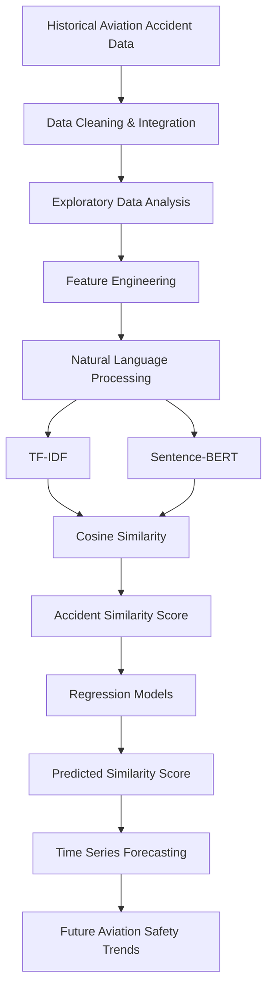

# MayDay-Aviation-Accident-Investigation-Intelligence-System
An aviation investigation intelligence system that uses machine learning and historical accident data to identify similar accident cases, retrieve investigation knowledge, and forecast aviation safety trends.

### Project Overview

MayDay: Aviation Accident Investigation Intelligence System is an AI-powered aviation safety analytics platform that combines Natural Language Processing (NLP), Machine Learning, and Time Series Forecasting to support aviation accident investigations.

The system assists investigators by analyzing historical aviation accident records to identify semantically similar accident cases, retrieve investigation knowledge, predict Accident Similarity Scores from structured aviation data, and forecast future aviation safety trends.

By integrating historical accident narratives, investigation findings, aircraft information, weather conditions, and operational data, MayDay transforms aviation accident data into actionable investigation intelligence for improved safety decision-making.

### Problem Statement

Aviation investigators often analyze thousands of historical accident reports, investigation findings, and safety recommendations to determine whether a current accident resembles previous events. This manual process is time-consuming and may overlook valuable historical knowledge.

MayDay addresses this challenge by leveraging Natural Language Processing (Sentence-BERT and TF-IDF), semantic similarity analysis, regression modeling, and time series forecasting to automatically identify similar accident cases, predict accident similarity scores, and discover long-term aviation safety trends.

### Project Goal

To develop an Aviation Investigation Intelligence System that uses machine learning and historical aviation accident data to identify similar accident cases, provide investigation knowledge, and forecast aviation safety trends.

### Data Source

National Transportation Safety Board (NTSB)

This project uses aviation accident and incident data obtained from the National Transportation Safety Board (NTSB) Aviation Accident Database.

The dataset contains detailed records of U.S. civil aviation accidents and incidents from 1982 to the present and includes information on accident events, aircraft characteristics, weather conditions, investigation findings, probable causes, flight operations, injuries, and accident narratives.

The dataset has been converted into structured CSV tables linked through a common event identifier, enabling relational analysis across multiple investigation components.

## Key Tables

* Events
* Aircraft
* Findings
* Narratives
* Flight Crew
* Injuries
* Occurrences
* Engines

Dataset Link:
https://www.kaggle.com/datasets/mirzaniazmorshed/ntsb-aviation-accidents/data

### Objectives

- Analyze historical aviation accident and incident data.
- Discover patterns within aviation accident narratives and structured investigation records.
- Compare TF-IDF and Sentence-BERT for semantic accident similarity analysis.
- Generate Accident Similarity Scores using semantic embeddings and cosine similarity.
- Develop regression models to predict Accident Similarity Scores.
- Forecast aviation safety trends using time series analysis.
- Build an intelligent investigation support platform for aviation safety professionals.

## Target Variable: Accident Similarity Score

The Accident Similarity Score is a continuous numerical value representing how semantically similar one aviation accident is to previous historical accident cases.

The score is generated using:

- Sentence-BERT embeddings
- TF-IDF vectorization (baseline)
- Cosine Similarity

Regression models are then trained to predict this similarity score using structured aviation features such as aircraft characteristics, weather conditions, operational information, engine details, and accident circumstances.

## Time Series Component
Accident Trend Forecasting

The project will forecast future trends in aviation accident categories, including:

Runway excursions
Loss of control events
Engine-related occurrences
Weather-related accidents
Operational incidents

The forecasts will help identify emerging aviation safety patterns and support proactive safety planning.

### Core Functionalities

## Similar Accident Finder

Searches historical aviation accident records and identifies accidents with characteristics similar to the current case.

Role:
Supports investigators by rapidly locating relevant historical cases and lessons learned.

## Investigation Knowledge Hub

Provides access to accident findings, probable causes, safety recommendations, and investigation summaries.

Role:
Acts as a centralized aviation investigation knowledge repository.

## FDR, CVR, and ATC Evidence Explorer

Organizes investigation information related to:

Flight Data Recorder (FDR) findings
Cockpit Voice Recorder (CVR) findings
Air Traffic Control (ATC) communications

Role:
Helps investigators understand evidence sources associated with historical accident cases.

## Aviation Safety Trend Dashboard

Visualizes aviation accident patterns and forecasted safety trends.

Role:
Supports safety monitoring and data-driven decision-making.

### Project Framework

### Expected Outcomes
Improved retrieval of aviation investigation knowledge.
Faster identification of similar historical accidents.
Better understanding of recurring aviation safety issues.
Enhanced support for aviation accident investigations.
Data-driven insights into future aviation safety trends. 

### Technologies

- Python
- Pandas
- NumPy
- Scikit-learn
- Sentence-Transformers (Sentence-BERT)
- TF-IDF Vectorizer
- Cosine Similarity
- XGBoost
- Random Forest
- Gradient Boosting
- Time Series Forecasting
- Matplotlib
- Seaborn
- Plotly
- SQL
- Tableau
- Jupyter Notebook
- GitHub

### Data Methodology

## 1. Data Collection

Aviation accident and incident data will be collected from the NTSB Aviation Accident Database and integrated from multiple relational tables, including events, aircraft, findings, narratives, injuries, and occurrence records.

## 2. Data Cleaning

* Handle missing values
* Remove duplicate records
* Standardize aircraft and location information
* Convert date fields into consistent formats
* Validate relationships between tables

## 3. Data Integration

Relevant tables will be merged using the Event ID (EV_ID) as the primary key to create a unified investigation dataset.

## 4. Exploratory Data Analysis (EDA)

The project will analyze:

* Aircraft types involved in accidents
* Weather conditions
* Flight phases
* Accident locations
* Investigation findings
* Probable causes
* Accident trends over time

## 5. Feature Engineering

Features will be derived from:

* Aircraft characteristics
* Weather observations
* Flight operation details
* Investigation findings
* Narrative reports
* Accident categories

## 6. Machine Learning

The machine learning workflow consists of:

- TF-IDF vectorization (baseline)
- Sentence-BERT semantic embeddings
- Cosine similarity computation
- Accident Similarity Score generation
- Regression modeling
- Hyperparameter tuning and model comparison
  

## 7. Time Series Forecasting

Time series models will be used to forecast trends in aviation accident categories and recurring safety issues over time.

## 8. System Development

The final system will provide:

* Similar Accident Finder
* Investigation Knowledge Hub
* FDR, CVR and ATC Evidence Explorer
* Aviation Safety Trend Dashboard

### Vision

MayDay aims to become an intelligent aviation investigation platform that transforms historical accident data into actionable investigation intelligence. By combining semantic search, machine learning, and predictive analytics, the system enables investigators to rapidly discover similar accident cases, understand contributing factors, and support data-driven aviation safety decisions.

## Data Science Capstone Project
